DAY 4 = # Jenkins CI/CD for Website Deployment on AWS
## AWS EC2 + Jenkins + Apache + Route 53 DNS + HTTPS

---

# Project Overview

This project demonstrates a production-ready CI/CD pipeline for deploying a static website on AWS using:

- AWS EC2 (Ubuntu Linux)
- Jenkins
- Apache Web Server
- AWS Route 53 DNS
- GitHub Webhooks
- HTTPS with Certbot

The goal is to automate website deployment directly from GitHub to a live AWS server without manual intervention.

---

# Real-World Scenario

You are a Junior DevOps Engineer at Your Techie Hub.

The frontend team continuously pushes updates to a GitHub repository.

Your responsibilities are to:

- Automatically pull website updates
- Deploy changes to a production server
- Configure DNS
- Enable HTTPS
- Ensure deployments happen automatically

---

# Architecture Overview

```text
GitHub Repository
        ↓
GitHub Webhook
        ↓
Jenkins CI/CD Server (AWS EC2 Ubuntu)
        ↓
Apache Web Server
        ↓
/var/www/html/myapp
        ↓
AWS Route 53 DNS
        ↓
www.auemeribetech.com.ng
        ↓
End Users
```
---
Project Structure

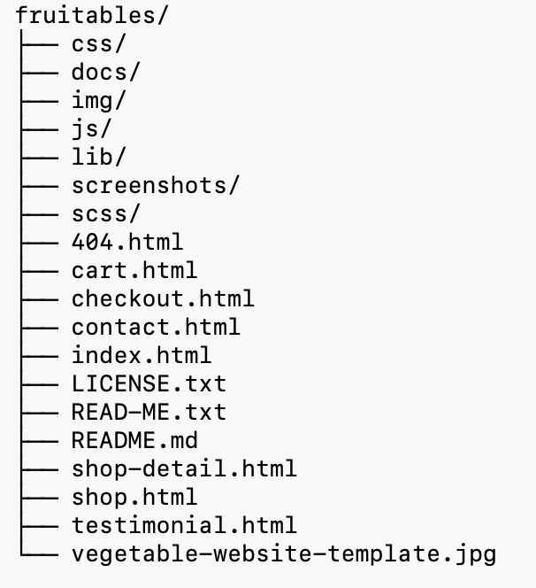
---

# Technologies Used

- Amazon EC2
- AWS CLI
- AWS Route 53
- Ubuntu Linux
- Jenkins
- Apache2
- GitHub
- GitHub Webhooks
- Certbot SSL

---

# Prerequisites

Before starting, ensure you have:

- AWS account
- GitHub account
- Domain name:
  
```text
auemeribetech.com.ng
```

- AWS CLI installed
- SSH client
- Basic Linux knowledge

---

# PHASE 0 — CREATE ARCHITECTURE DIAGRAM

# Generate Architecture Diagram

## Step 1 - Install Graphviz locally using Homebrew:

```bash
/bin/bash -c "$(curl -fsSL https://raw.githubusercontent.com/Homebrew/install/HEAD/install.sh)"

brew install graphviz
```
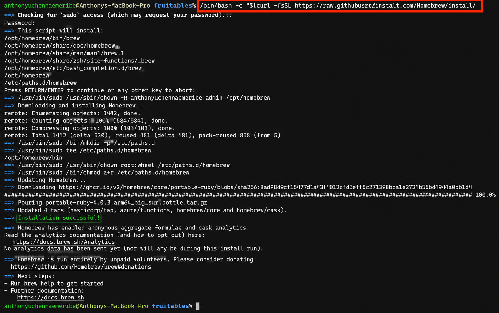


## Step 2 - Verify installation

```bash
dot -V
```
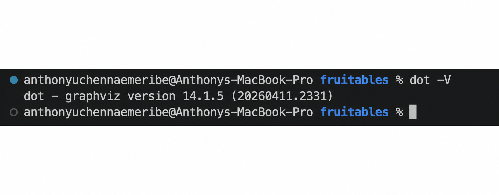


## Step 3 - Create diagram source

```bash
nano docs/architecture-diagram.dot
```

Paste:

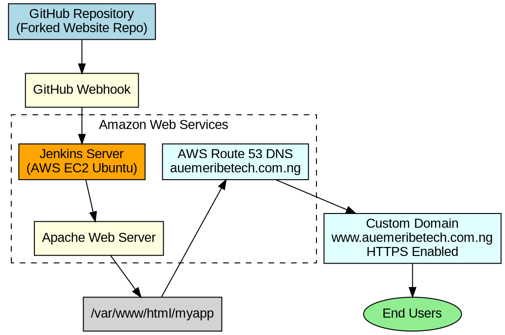
```dot
digraph Jenkins_AWS_CICD {
    rankdir=TB;
    fontname="Arial";

    node [
        shape=box,
        style=filled,
        fontname="Arial"
    ];

    github [
        label="GitHub Repository\n(Forked Website Repo)",
        fillcolor="lightblue"
    ];

    webhook [
        label="GitHub Webhook",
        fillcolor="lightyellow"
    ];

    jenkins [
        label="Jenkins Server\n(AWS EC2 Ubuntu)",
        fillcolor="orange"
    ];

    apache [
        label="Apache Web Server",
        fillcolor="lightyellow"
    ];

    deploy [
        label="/var/www/html/myapp",
        fillcolor="lightgrey"
    ];

    route53 [
        label="AWS Route 53 DNS\nauemeribetech.com.ng",
        fillcolor="lightcyan"
    ];

    domain [
        label="Custom Domain\nwww.auemeribetech.com.ng\nHTTPS Enabled",
        fillcolor="lightcyan"
    ];

    users [
        label="End Users",
        shape=ellipse,
        fillcolor="lightgreen"
    ];

    github -> webhook;
    webhook -> jenkins;
    jenkins -> apache;
    apache -> deploy;
    deploy -> route53;
    route53 -> domain;
    domain -> users;

    subgraph cluster_aws {
        label="Amazon Web Services";
        style=dashed;

        jenkins;
        apache;
        route53;
    }
}
```
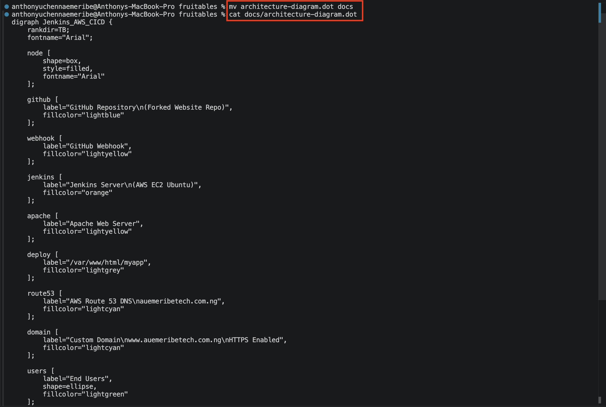

## Step 4 - Generate PNG:
```bash
dot -Tpng architecture-diagram.dot -o architecture-diagram.png
```

## Step 5 - Generate SVG:

```bash
dot -Tsvg architecture-diagram.dot -o architecture-diagram.svg
```
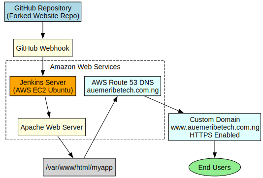

---

# PHASE 1 — FORK GITHUB REPOSITORY

---
## Step 1 — Fork Repository Using GitHub CLI

1. Authenticate GitHub CLI if not already authenticated:
```bash
gh auth login
```
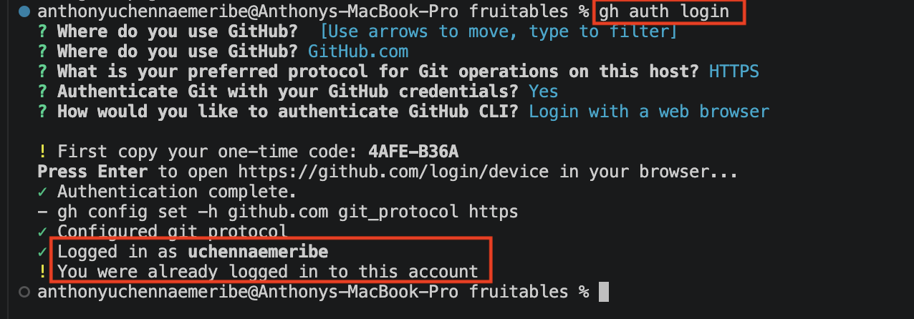

2. Fork the repository:
```bash
gh repo fork yourtechie/fruitables --clone
```
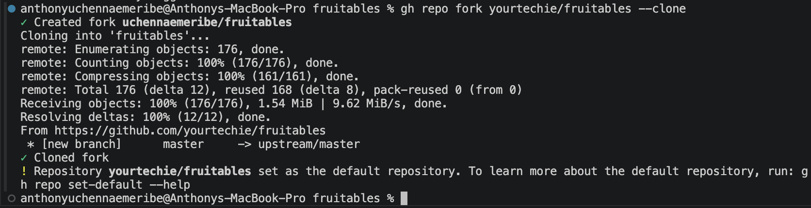

3. This command will:
- Fork the repository to your GitHub account
- Automatically clone it locally

4. Move into the project directory:
```bash
cd fruitables
```
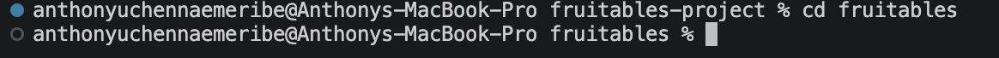

5. Verify the configured remotes:
```bash
git remote -v
```
Expected output:
```text
origin    https://github.com/YOUR_USERNAME/fruitables.git (fetch)
origin    https://github.com/YOUR_USERNAME/fruitables.git (push)
upstream  https://github.com/yourtechie/fruitables.git (fetch)
upstream  https://github.com/yourtechie/fruitables.git (push)
```
This confirms:
- `origin` points to your fork
- `upstream` points to the original repository

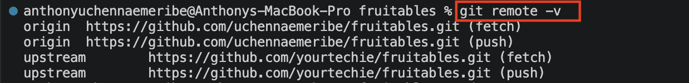

---

# PHASE 2 — CREATE AWS EC2 SERVER

---

## Step 2 — Configure AWS CLI

Run:

```bash
aws configure
```

Provide:
- AWS Access Key
- AWS Secret Key
- Region
- Output format

Example region:

```text
us-east-1
```
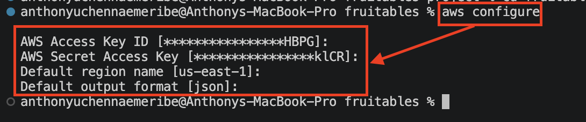
---

## Step 3 — Create Security Group

Create security group:

```bash
aws ec2 create-security-group --group-name jenkins-sg --description "Jenkins Security Group"
```
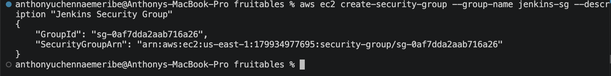
Save the returned Security Group ID.

---

## Step 4 — Open Required Ports

### Open SSH Port

```bash
aws ec2 authorize-security-group-ingress --group-name jenkins-sg --protocol tcp --port 22 --cidr 0.0.0.0/0
```
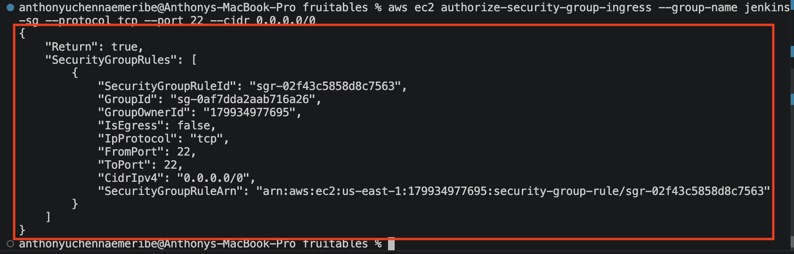
---

### Open HTTP Port

```bash
aws ec2 authorize-security-group-ingress --group-name jenkins-sg --protocol tcp --port 80 --cidr 0.0.0.0/0
```
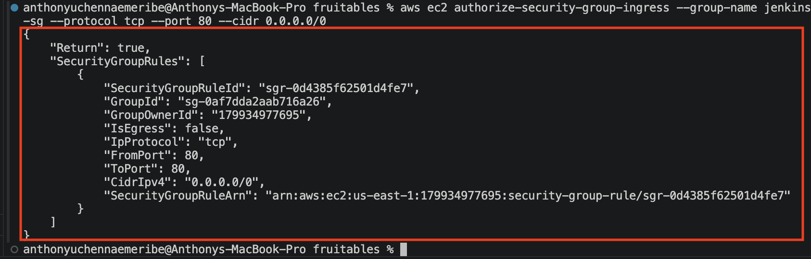
---

### Open HTTPS Port

```bash
aws ec2 authorize-security-group-ingress --group-name jenkins-sg --protocol tcp --port 443 --cidr 0.0.0.0/0
```
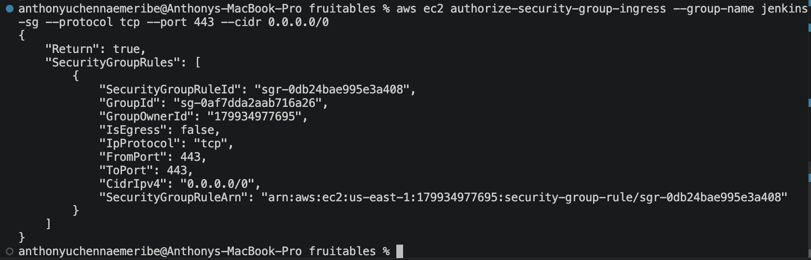
---

### Open Jenkins Port

```bash
aws ec2 authorize-security-group-ingress --group-name jenkins-sg --protocol tcp --port 8080 --cidr 0.0.0.0/0
```
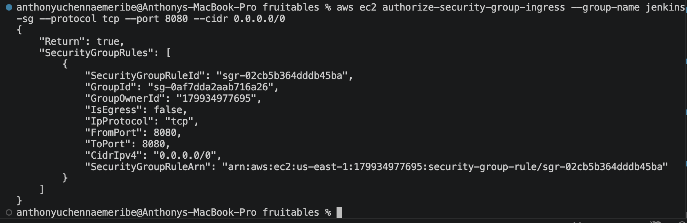
---
## Step 5 — Create Key Pair

```bash
aws ec2 create-key-pair --key-name jenkins-key --query 'KeyMaterial' --output text > jenkins-key.pem
```

Secure key:

```bash
chmod 400 jenkins-key.pem
```
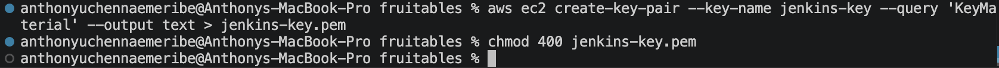
---

## Step 6 — Launch EC2 Instance

```bash
aws ec2 run-instances --image-id ami-0fc5d935ebf8bc3bc --instance-type t3.small --key-name jenkins-key --security-groups jenkins-sg --tag-specifications 'ResourceType=instance,Tags=[{Key=Name,Value=Jenkins-Server}]'
```
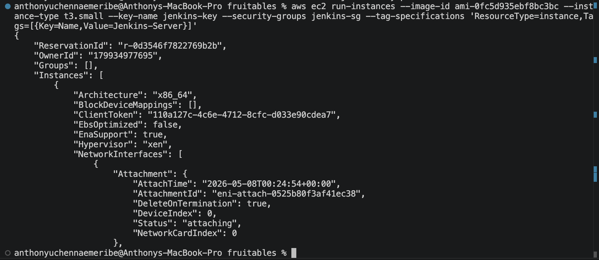
---

## Step 7 — Get Public IP

```bash
aws ec2 describe-instances --query "Reservations[*].Instances[*].PublicIpAddress" --output text
```

Save the public IP.

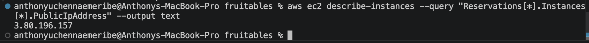
---

# PHASE 3 — CONNECT TO EC2 INSTANCE

---

## Step 8 — SSH Into EC2

```bash
ssh -i jenkins-key.pem ubuntu@3.80.196.157
```

Example:

```bash
ssh -i jenkins-key.pem ubuntu@3.80.196.157
```
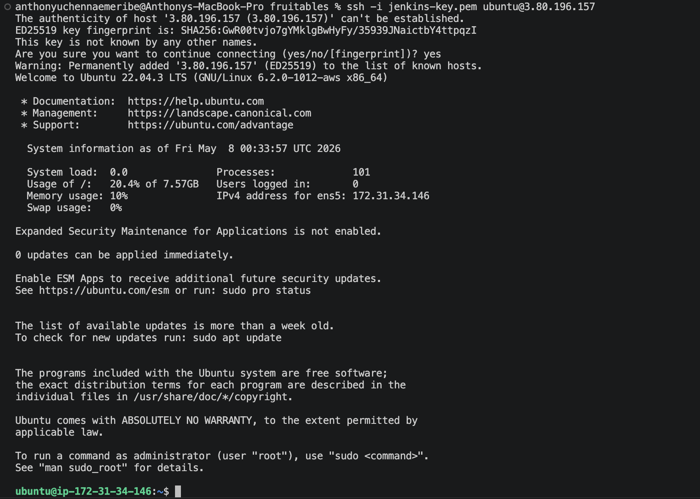
---

# PHASE 4 — INSTALL REQUIRED SOFTWARE

---

## Step 9 — Update Ubuntu Server

```bash
sudo apt update && sudo apt upgrade -y
```
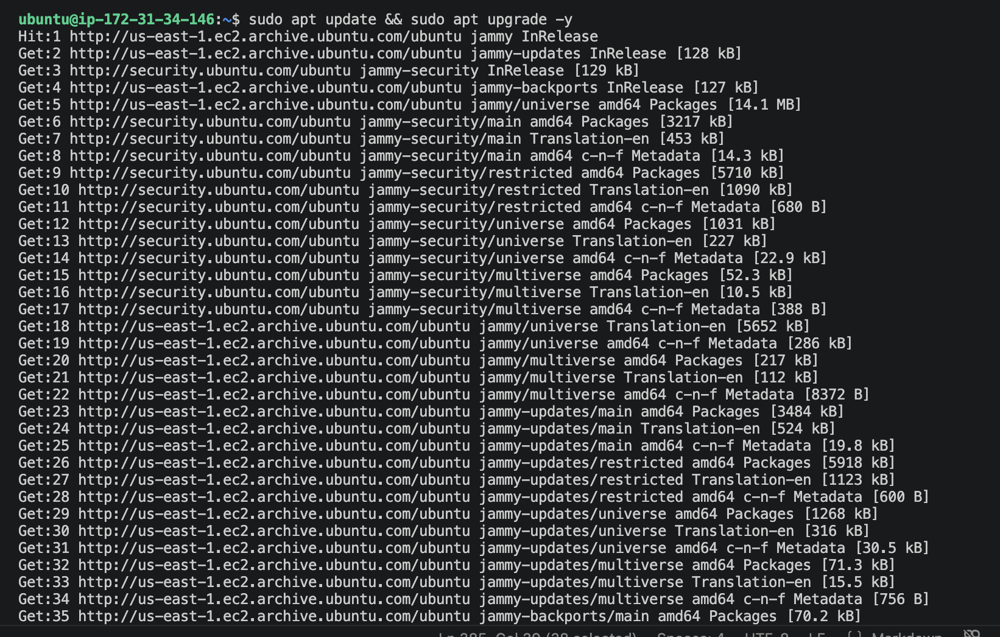
---

## Step 10 — Install Java

Jenkins requires Java.

```bash
sudo apt install fontconfig openjdk-21-jre -y
```
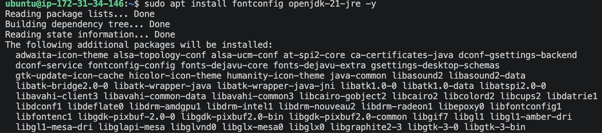

Verify:

```bash
java -version
```
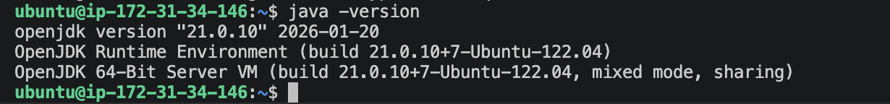
---

## Step 11 — Install Jenkins

```bash
sudo wget -O /etc/apt/keyrings/jenkins-keyring.asc https://pkg.jenkins.io/debian-stable/jenkins.io-2026.key 
```
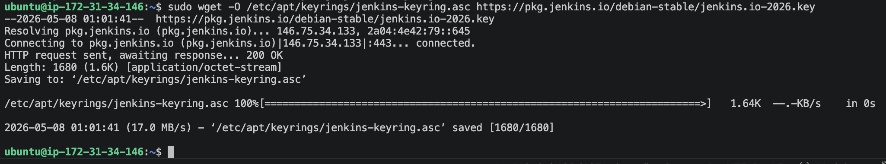
Add repository:

```bash
echo "deb [signed-by=/etc/apt/keyrings/jenkins-keyring.asc] https://pkg.jenkins.io/debian-stable binary/" | sudo tee /etc/apt/sources.list.d/jenkins.list > /dev/null
```
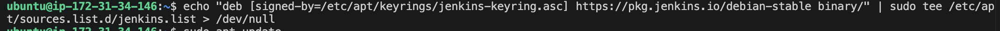

Install Jenkins:

```bash
sudo apt update
sudo apt install jenkins -y
```
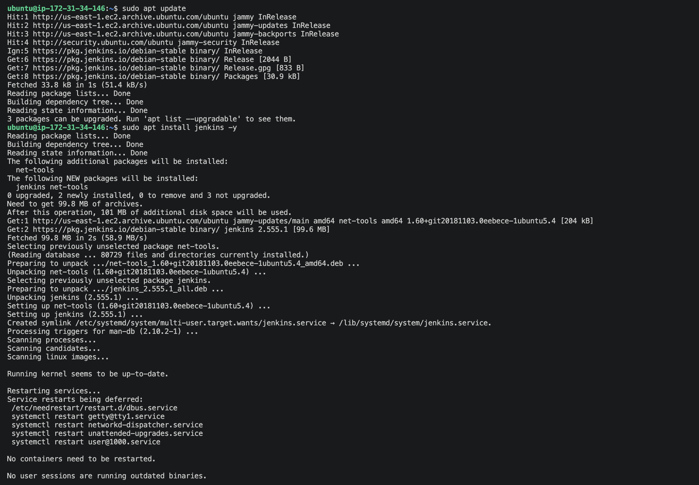
---

## Step 12 — Start Jenkins

```bash
sudo systemctl start jenkins
sudo systemctl enable jenkins
```
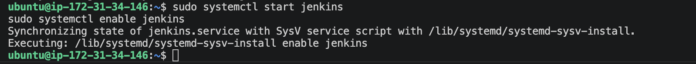

Verify:

```bash
sudo systemctl status jenkins
```
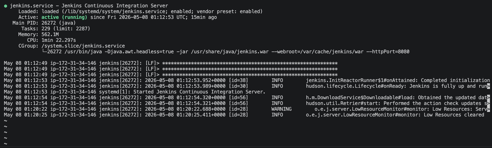

---
## Step 13 — Access Jenkins

Visit:

```text
http://3.80.196.157:8080
```
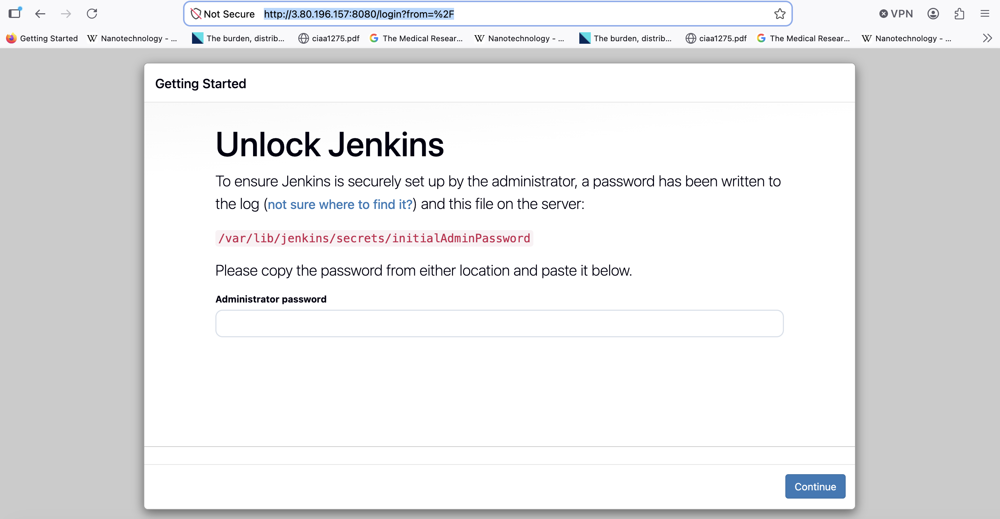
---

## Step 14 — Unlock Jenkins

Run:

```bash
sudo cat /var/lib/jenkins/secrets/initialAdminPassword
```

Copy password into browser.

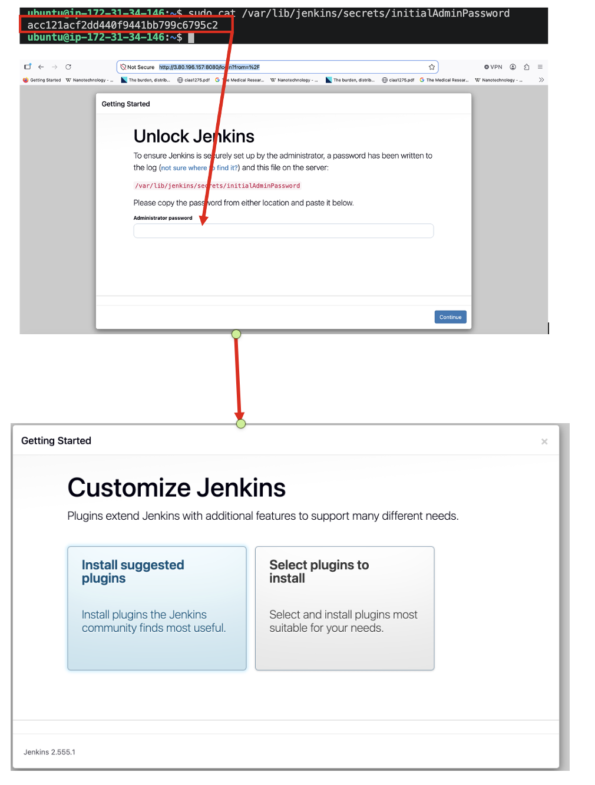
---

## Step 15 — Install Suggested Plugins

Choose:

```text
Install suggested plugins
```
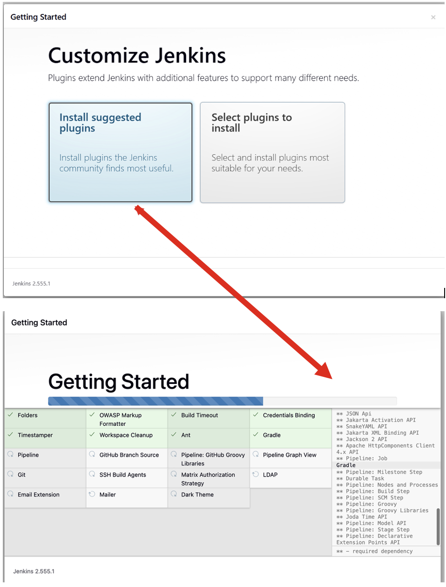
---

## Step 16 — Create Jenkins Admin User

1. Create or skip and continue as admin:
- username
- password
- email

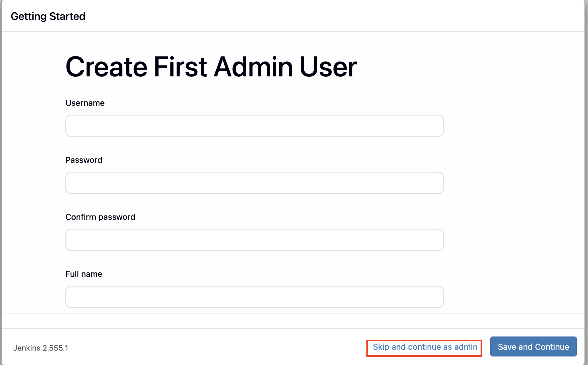

2. Configure Jenkins using the default

```text
http://3.80.196.157:8080/
```
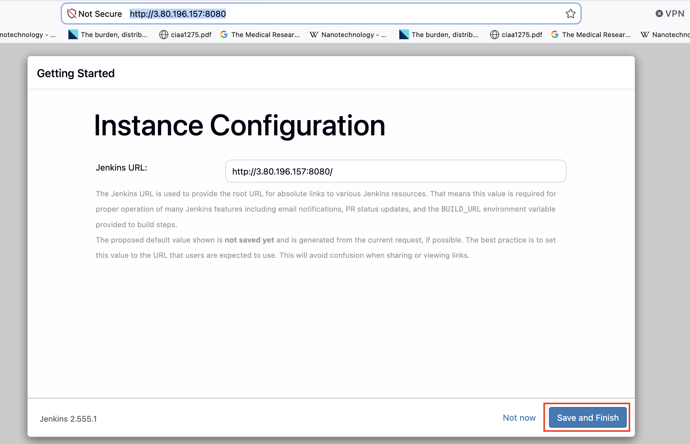

3. Select:
```text
Start using Jenkins
```
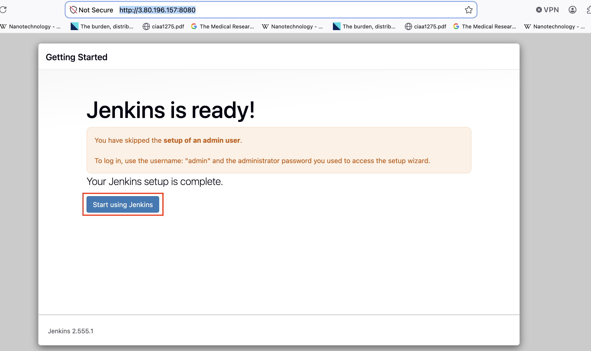
---

# PHASE 5 — INSTALL APACHE WEB SERVER

---

## Step 17 — Install Apache

```bash
sudo apt install apache2 -y
```
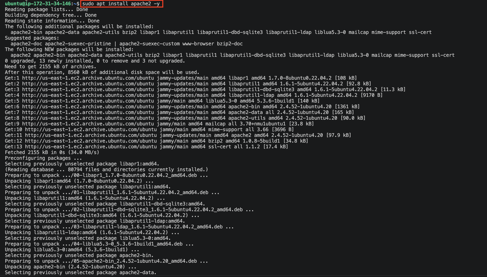
---

## Step 18 — Start Apache

```bash
sudo systemctl start apache2
sudo systemctl enable apache2
```
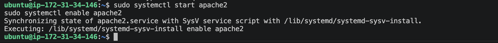
---

## Step 19 — Verify Apache

Visit:

```text
http://3.80.196.157
```
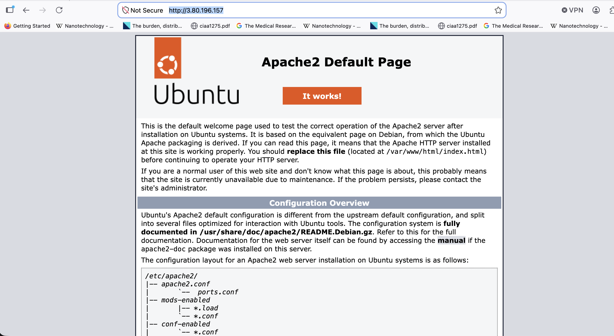
Apache default page should appear.

---

## Step 20 — Create Deployment Directory

```bash
sudo mkdir -p /var/www/html/myapp
```

Set permissions:

```bash
sudo chown -R www-data:www-data /var/www/html/myapp
sudo chmod -R 755 /var/www/html/myapp
```
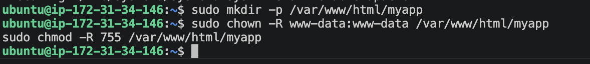
---

## Step 21 — Test Deployment Directory
1. Run:
```bash
echo "<h1>Apache is working</h1>" | sudo tee /var/www/html/myapp/index.html
```
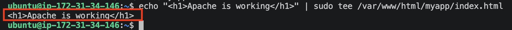

2. Visit:

```text
http://3.80.196.157/myapp
```
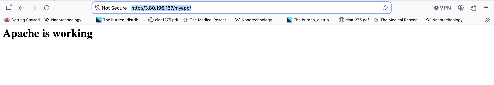
---

# PHASE 6 — CONFIGURE JENKINS PERMISSIONS

---

## Step 22 — Grant Jenkins Access

```bash
sudo usermod -aG www-data jenkins
```
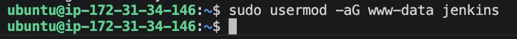
---

## Step 23 — Configure Directory Permissions

```bash
sudo chown -R jenkins:www-data /var/www/html/myapp
sudo chmod -R 775 /var/www/html/myapp
```
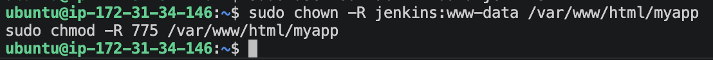
---

## Step 24 — Allow Jenkins Sudo Access
1. Run:
```bash
sudo visudo
```

2. Add:

```text
jenkins ALL=(ALL) NOPASSWD: ALL
```

3. Save and exit.

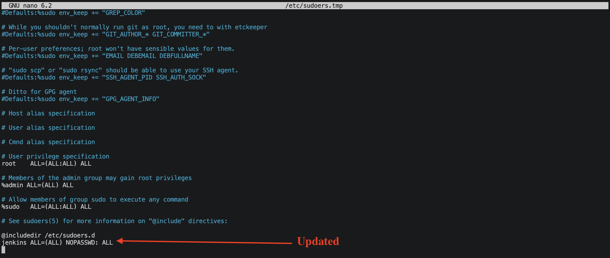
---

# PHASE 7 — CONFIGURE JENKINS FREESTYLE JOB

---

## Step 25 — Create Jenkins Job

1. Login to Jenkins if logged out from the VM using
```bash
ssh -i jenkins-key.pem ubuntu@3.80.196.157
```

2. If asked for login details when you initially byepassed it use
```text
Username: admin
```
3. Retrieve the admin password using
```bash
sudo cat /var/lib/jenkins/secrets/initialAdminPassword
```

4. Enter
```text
Password (example): acc121acf2dd440f9441bb799c6795c2
```
5. Go to:

```text
Jenkins Dashboard
→ New Item
```

Name:

```text
deploy-static-site
```

Select:

```text
Freestyle Project
```
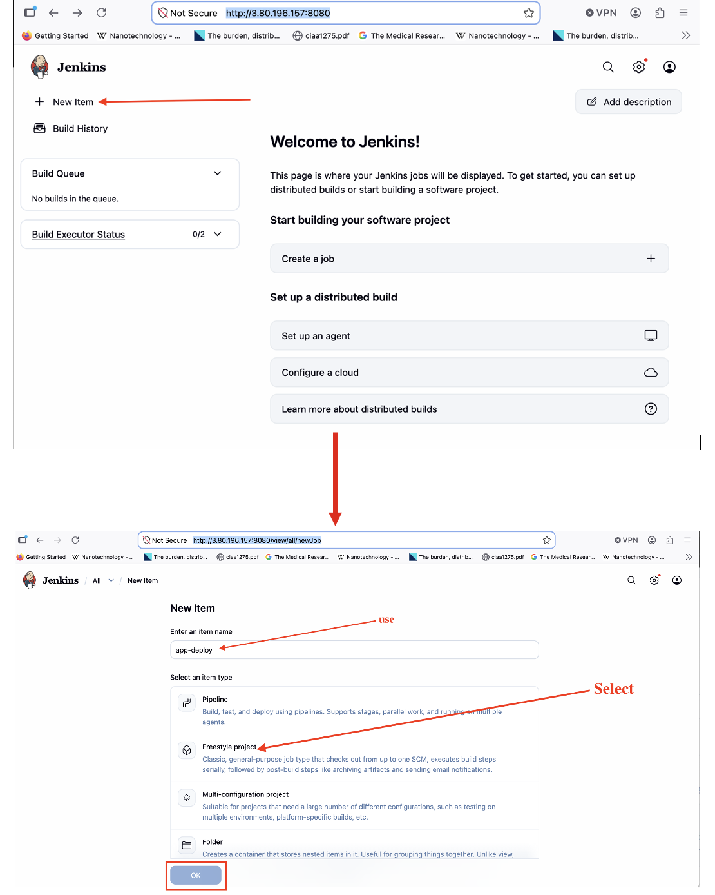
---

## Step 26 — Configure Git Repository

1. Under:

```text
Source Code Management
```

2. Select:

```text
Git
```

Repository URL:

```text
https://github.com/uchennaemeribe/fruitables.git
```
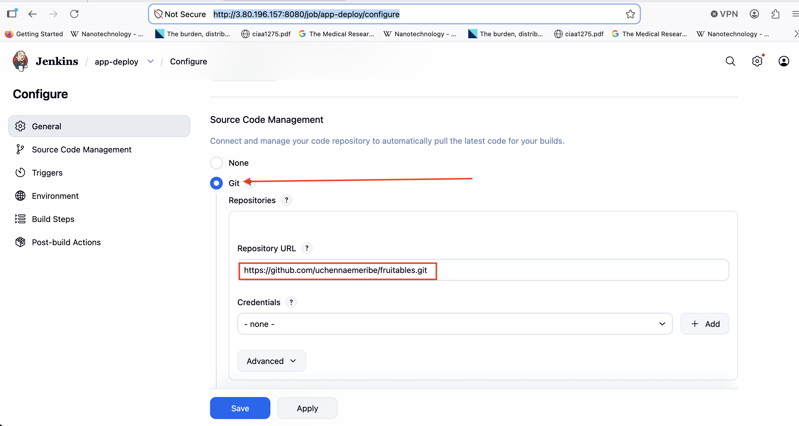
---

## Step 27 — Configure Build Trigger

Enable:

```text
GitHub hook trigger for GITScm polling
```
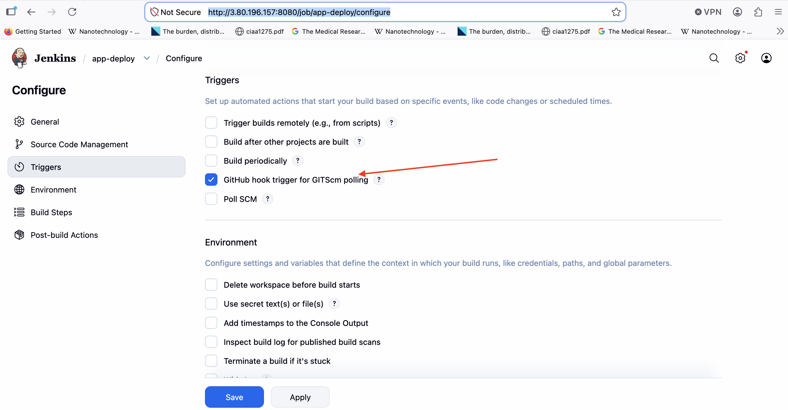
---

## Step 28 — Add Build Step

1. Go to:

```text
Build
→ Add Build Step
→ Execute Shell
```

2. Add to the command shell:

```bash
echo "Starting deployment..."

sudo mkdir -p /var/www/html/myapp

sudo rm -rf /var/www/html/myapp/*

sudo cp -r * /var/www/html/myapp/

sudo chown -R www-data:www-data /var/www/html/myapp

sudo systemctl restart apache2

echo "Deployment completed!"
```
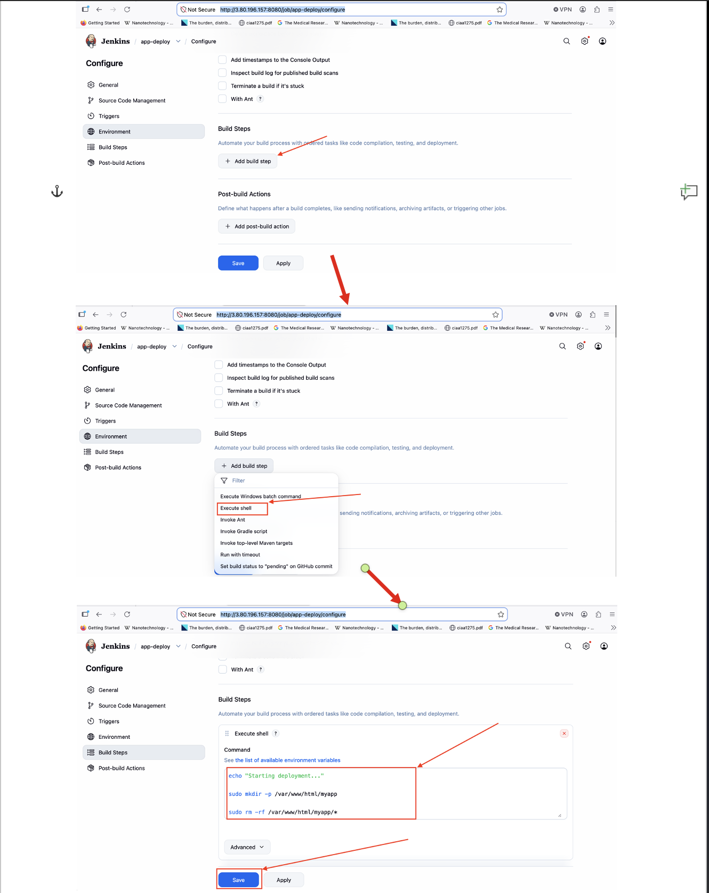

3. Save job.

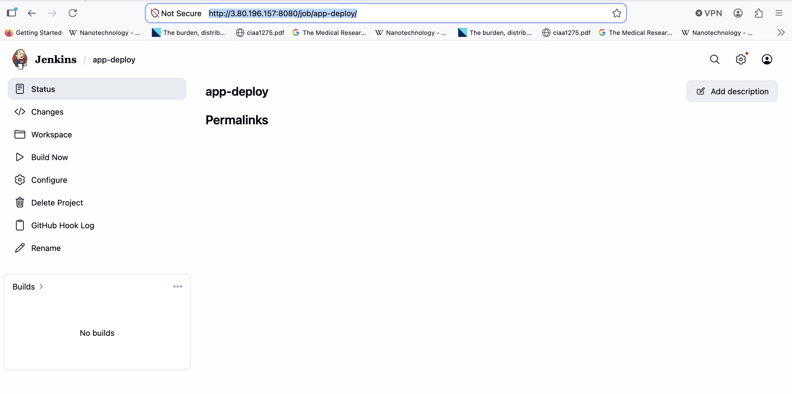
---

# PHASE 8 — ENABLE AUTOMATIC DEPLOYMENT

---

## Step 29 — Configure GitHub Webhook

1. Go to:

```text
GitHub Repository
→ Settings
→ Webhooks
→ Add Webhook
```

Payload URL:

```text
http://YOUR_PUBLIC_IP:8080/github-webhook/
```

Content type:

```text
application/json
```

Save webhook.

---

# PHASE 9 — TEST CI/CD PIPELINE

---

## Step 30 — Push Changes to GitHub

Modify website files.

Push:

```bash
git add .
git commit -m "Test Jenkins deployment"
git push origin main
```

---

## Step 31 — Verify Jenkins Build

Go to:

```text
Jenkins Dashboard
→ Build History
```

The build should trigger automatically.

---

## Step 32 — Verify Website Deployment

Visit:

```text
http://YOUR_PUBLIC_IP/myapp
```

---

# PHASE 10 — CONFIGURE AWS ROUTE 53 DNS

---

## Step 33 — Create Hosted Zone

```bash
aws route53 create-hosted-zone \
    --name auemeribetech.com.ng \
    --caller-reference "$(date)"
```

---

## Step 34 — Get Route 53 Nameservers

```bash
aws route53 list-hosted-zones
```

Then:

```bash
aws route53 get-hosted-zone \
    --id HOSTED_ZONE_ID
```

Copy the Route 53 nameservers.

---

## Step 35 — Update Domain Registrar Nameservers

Go to:
- QServers
- Namecheap
- GoDaddy

Replace existing nameservers with Route 53 nameservers.

Wait for DNS propagation.

---

## Step 36 — Create Root Domain A Record

Create:

```json
{
  "Comment": "Root domain record",
  "Changes": [
    {
      "Action": "UPSERT",
      "ResourceRecordSet": {
        "Name": "auemeribetech.com.ng",
        "Type": "A",
        "TTL": 300,
        "ResourceRecords": [
          {
            "Value": "YOUR_PUBLIC_IP"
          }
        ]
      }
    }
  ]
}
```

Save as:

```text
root-record.json
```

Apply:

```bash
aws route53 change-resource-record-sets \
    --hosted-zone-id HOSTED_ZONE_ID \
    --change-batch file://root-record.json
```

---

## Step 37 — Create WWW Record

Create:

```json
{
  "Comment": "WWW domain record",
  "Changes": [
    {
      "Action": "UPSERT",
      "ResourceRecordSet": {
        "Name": "www.auemeribetech.com.ng",
        "Type": "A",
        "TTL": 300,
        "ResourceRecords": [
          {
            "Value": "YOUR_PUBLIC_IP"
          }
        ]
      }
    }
  ]
}
```

Save as:

```text
www-record.json
```

Apply:

```bash
aws route53 change-resource-record-sets \
    --hosted-zone-id HOSTED_ZONE_ID \
    --change-batch file://www-record.json
```

---

# PHASE 11 — ENABLE HTTPS

---

## Step 38 — Install Certbot

```bash
sudo apt install certbot python3-certbot-apache -y
```

---

## Step 39 — Configure SSL

```bash
sudo certbot --apache
```

Choose:
- auemeribetech.com.ng
- www.auemeribetech.com.ng
- Redirect HTTP to HTTPS

---

## Step 40 — Verify HTTPS

Visit:

```text
https://www.auemeribetech.com.ng
```

Your website should now be secured.

---

# Common Errors and Fixes

## Jenkins Not Accessible

Fix:
- verify port 8080
- verify security group

---

## Apache Forbidden Error

Fix:

```bash
sudo chown -R www-data:www-data /var/www/html/myapp
```

---

## Webhook Not Triggering

Fix:
- verify webhook URL
- verify Jenkins trigger enabled

---

## HTTPS Certbot Failure

Fix:
- verify Route 53 nameservers
- verify A records
- wait for DNS propagation

---

# Final Outcome

You successfully built:

- AWS EC2 Infrastructure
- Jenkins CI/CD Pipeline
- Automated Website Deployment
- AWS Route 53 DNS Integration
- HTTPS Secure Website
- Production Apache Web Server
- Automated GitHub Deployments

---

# .gitignore

Create:

```text
.gitignore
```

Add:

```gitignore
node_modules/
.env
.DS_Store
*.pem
*.log
coverage/
dist/
```

---

# Cleanup Resources

Terminate EC2 instance after testing to avoid charges.

---

# Author

Anthony Uchenna Emeribe

Cloud / DevOps Engineer